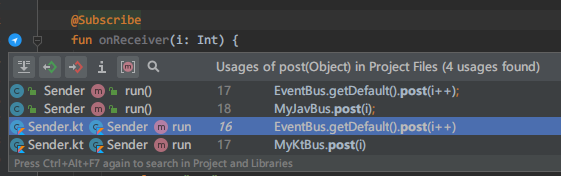
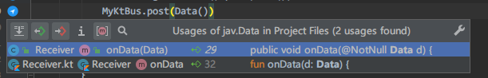
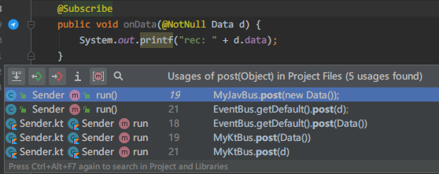
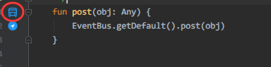

#  EventBus-Navigator

> A plugin for IDEA and Android Studio.

[中文介绍](ReadMe_zh.md)

- **Kotlin** language support
- support encapsulated `post` function
- based on [likfe/eventbus3-intellij-plugin](https://github.com/likfe/eventbus3-intellij-plugin)

## Preview

Receiver function what is annotate with `@Subscribe`

### Kotlin subscriber function



### Kotlin publisher expression



### Java subscriber function


### Java publisher expression

...


## Make a encapsulated post function as a poster function

  Right click at a function name.


then you can find this icon




### Install

1. Marketplace

IDEA or Android Studio `Settings/Plugins/Marketplace` search `EventBus-Navigator`

2. download [EventBus-Navigator.jar](https://github.com/Vove7/EventBus-Navigator/blob/master/EventBus-Navigator.jar) file.

`Settings/Plugins/` Install Plugin from Disk.


## Warning

Not support navigate from that java or kotlin post primitive type to kotlin receiver function, but java receiver is ok.
  
primitive type :

```
"kotlin.Int" to "java.lang.Integer",
"kotlin.Boolean" to "java.lang.Boolean",
"kotlin.Char" to "java.lang.Character",
"kotlin.Double" to "java.lang.Double",
"kotlin.Float" to "java.lang.Float",
"kotlin.Long" to "java.lang.Long",
"kotlin.Any" to "java.lang.Object",
"kotlin.String" to "java.lang.String"
```
  

## Thanks

- [likfe/eventbus3-intellij-plugin](https://github.com/likfe/eventbus3-intellij-plugin)
- [kgmyshin/eventbus3-intellij-plugin](https://github.com/kgmyshin/eventbus3-intellij-plugin)