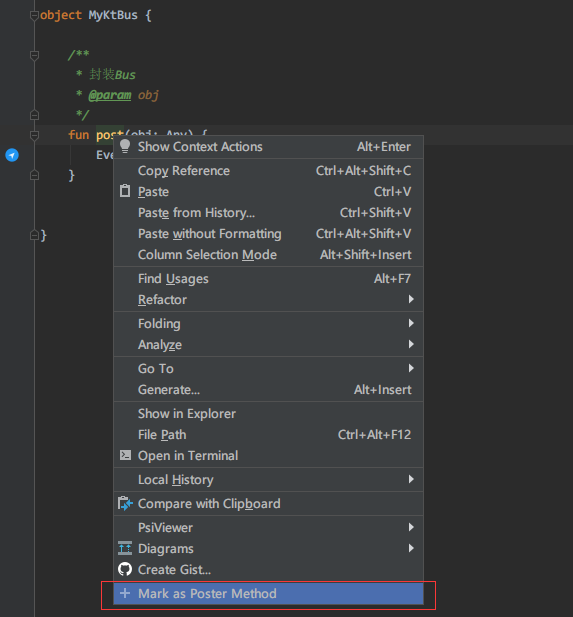

#  EventBus-Navigator

> A plugin for IDEA and Android Studio.

[中文介绍](ReadMe_zh.md)

- **Kotlin** language support
- Support encapsulated `post` function
- Support primitive type
- based on [likfe/eventbus3-intellij-plugin](https://github.com/likfe/eventbus3-intellij-plugin)

## Preview

Receiver function what is annotate with `@Subscribe`

### Kotlin subscriber function

### Kotlin publisher expression

### Java subscriber function

### Java publisher expression

...

## Make a encapsulated post function as a poster function

  Right click at a function name.

then you can find this icon

### Install

1. Marketplace

IDEA or Android Studio `Settings/Plugins/Marketplace` search `EventBus-Navigator`

2. download [EventBus-Navigator.jar](https://github.com/Vove7/EventBus-Navigator/blob/master/EventBus-Navigator.jar) file.

`Settings/Plugins/` Install Plugin from Disk.

## Thanks

- [likfe/eventbus3-intellij-plugin](https://github.com/likfe/eventbus3-intellij-plugin)
- [kgmyshin/eventbus3-intellij-plugin](https://github.com/kgmyshin/eventbus3-intellij-plugin)