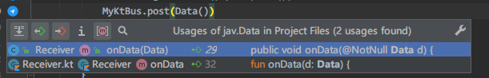
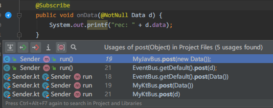
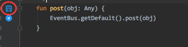

# EventBus 导航器

> A plugin for IDEA and Android Studio.

- 支持Kotlin语言
- 支持封装的YourBus.post函数
- 支持基础类型
- 修改于 [likfe/eventbus3-intellij-plugin](https://github.com/likfe/eventbus3-intellij-plugin)

## 预览

Receiver function what is annotate with `@Subscribe`

### Kotlin subscriber function

### Kotlin publisher expression

### Java subscriber function

### Java publisher expression

...

## 标记自封装post函数

  在函数名右键

  随后可发现多出一标志

### 安装

1. Marketplace

IDEA or Android Studio `Settings/Plugins/Marketplace` search `EventBus-Navigator`

2. 下载 [EventBus-Navigator.jar](https://github.com/Vove7/EventBus-Navigator/blob/master/EventBus-Navigator.jar) .

`Settings/Plugins/` Install Plugin from Disk.

## Thanks

- [likfe/eventbus3-intellij-plugin](https://github.com/likfe/eventbus3-intellij-plugin)
- [kgmyshin/eventbus3-intellij-plugin](https://github.com/kgmyshin/eventbus3-intellij-plugin)